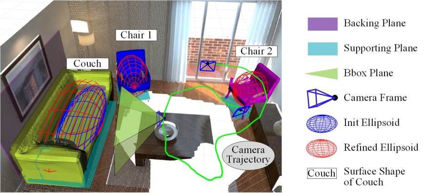
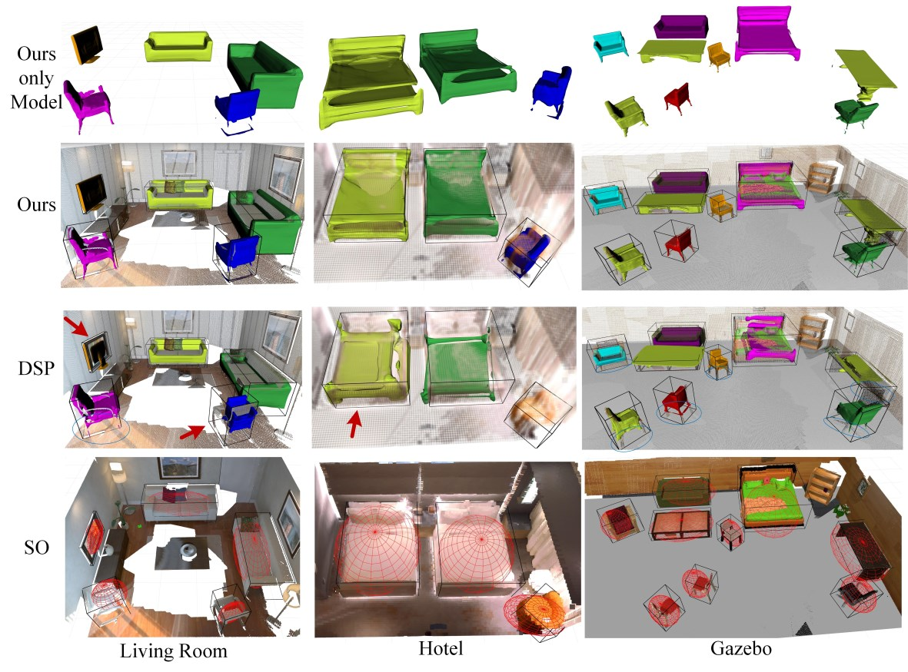

# This repository contains the open-source implementation of the paper  **"QDSP-SLAM: Indoor Object Oriented SLAM Coupling Dual Quadrics and Deep Shape Priors."**  

Comprehensive usage instructions and documentation are currently being prepared and will be made available soon.

